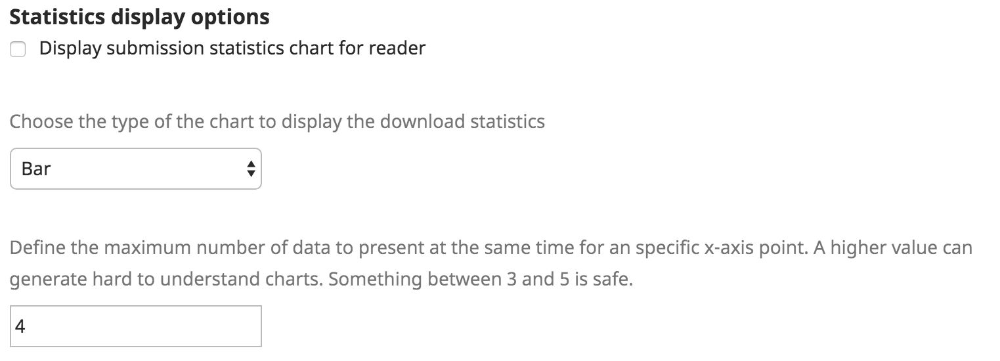

# Frequently Asked Questions

This isn’t an exhaustive list. If you are running into further questions for which you don’t have answers, notify your hosting service provider, or take a look at the PKP Community Forum &lt;[https://forum.pkp.sfu.ca](https://forum.pkp.sfu.ca)&gt; to see if anyone else has run into the same thing.

**Q: What’s the best possible thing I could do to ensure accurate usage reporting?**

A: First, upgrade to the latest stable version of OJS 2 or 3. Optionally, also consider reprocessing your logs \(see Appendix B: Processing your Log Files\).

Second, figure out what statistics you want, and use the same method to get them each time. If you are using the Custom Report Generator, make sure you save the URL it provides to you so you can re-run that particular report.

**Q: Do you have any suggestions for which reports to use?**

A: It all depends on what kind of data you need. For legacy data \(ie. data from pre-2.4.3\), the Views report gives a great overall snapshot of article usage, and it’s the least complicated metric to understand.

For more recent data, we’d really recommend the Custom Report Generator. It’s quite complex, but it can provide a very wide range of data, and uses the Statistics Framework to its fullest. Just make sure that you use it consistently! We have included a great set of tips and tricks, written by our colleague Andrea Kosavic at York University Library, at the end of this document, that focuses specifically on the Custom Report Generator.

**Q: I’ve recently upgraded from an old version of OJS, and I’d like to use the improved Statistics Framework for visits from before the upgrade. Can I do this?**

A: Yes, but only if you have web server logs from before the time that you upgraded. If you have these web server logs \(eg. Apache access\_log files\) from before the upgrade, you can process these \(See Appendix B: Processing Log Files\). If you don’t have these old logs, you are unfortunately out of luck.

Also, it’s worth noting that you can still retrieve the old, basic usage metrics using the legacy reports \(in OJS 2 only - not OJS 3\). These aren’t as comprehensive as the new metrics, and they have bot visits and multi-clicks included as well, but they are still a good representation of general usage.

**Q: I’ve seen some OJS journals that display nice-looking article usage metrics on article landing pages. How do I configure that?**

A: This option is only available for OJS 3. It can be enabled by going to the generic Usage Statistics plugin’s Settings page:

`Dashboard > Settings > Website > Plugins > Generic Plugins > Usage Statistics Plugin > Settings`  

From there you will have an option to enable the Statistics Display option:

If you enable it, article metrics will appear on the article landing page:

